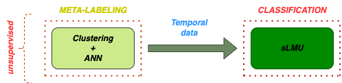
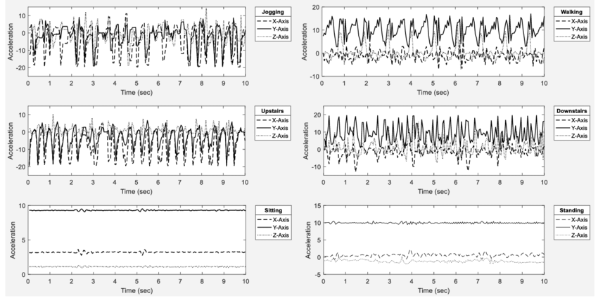

 

  

<h3 align="center">GU02 Project Report - Bioinspired Temporal Data</h3>

  

    The project is related to the Human Activity Recognition problem according to time-dependent signals from wearable devices
     
    <a href="https://github.com/MLinApp-polito/mla-prj-01-gu2/blob/main/report.pdf"><strong>Explore the report »</strong></a>
     
     
  

<!-- TABLE OF CONTENTS -->

  
Table of Contents

  <ol>
    <li>
      <a href="#dataset">Dataset</a>
    </li>
    <li>
      <a href="#model">Model</a>
    </li>
    <li>
      <a href="#nni">NNI Optimization</a>
    </li>
    <li><a href="#contributors">Contributors</a></li>
  </ol>

<!-- ABOUT THE PROJECT -->
# Dataset

  

The **WISDM dataset** could be reached from the [dataset](https://drive.google.com/drive/folders/1T4QHQCKpAyYBB8hqd2-wsE4s_POkOCaH?usp=sharing) google drive folder. It is saved in a ***.npz format*** and there is no need to to save it on your google drive environment. In any case you can of course download it: 

  <a href=https://drive.google.com/drive/folders/1T4QHQCKpAyYBB8hqd2-wsE4s_POkOCaH?usp=sharing"> WISDM </a>

(<a href="#top">back to top</a>)

# Model
With the [file](https://github.com/MLinApp-polito/mla-prj-01-gu2/blob/main/notebooks/K-MEANS%20for%20WISDM%20meta-labeling.ipynb) reported in the repo, we decided to apply to the WISDM data:
- **KMEANS** clustering to split data on the basis of the membership classes
- **LDA** to better visualize the result of clustering
- **LSTM** to carry out a preliminary classification of the data available to us
- **PCA** to extract the most significant components associated with the data of each individual cluster
- **LMU** to verify classification performance for each cluster (see [file](https://github.com/MLinApp-polito/mla-prj-01-gu2/blob/main/notebooks/LMU%20for%20the%20Clusters.ipynb))

### LSTM
The results for the application of the **LSTM** could be visualized in this [folder](https://github.com/MLinApp-polito/mla-prj-01-gu2/tree/main/lstm)

### LMU
The results for the application of the **LMU** could be visualized in this [folder](https://github.com/MLinApp-polito/mla-prj-01-gu2/tree/main/lmu)

# NNI Optimization
After this we carried out the optimization of the parameters associated with the sLMU through the use of **NNI**, to verify the final classification performance both for the single clusters and for the entire dataset. The results could be reached from this [folder](https://github.com/MLinApp-polito/mla-prj-01-gu2/tree/main/evaluations)

# Contributors:
The project was developed by:
- [Stefano Rainò][steo-url], s282436
- [Alberto Castrignanò][albo-url], s281689
- [Lorenzo Mercurio][lome-url], s290903

<!-- MARKDOWN LINKS & IMAGES -->
<!-- https://www.markdownguide.org/basic-syntax/#reference-style-links -->
[contributors-shield]: https://img.shields.io/github/contributors/github_username/repo_name.svg?style=for-the-badge

[steo-url]: https://github.com/steo13

[lome-url]: https://github.com/LorenzoMercurio10

[albo-url]: https://github.com/AlbInitPolito

[forks-shield]: https://img.shields.io/github/forks/github_username/repo_name.svg?style=for-the-badge
[forks-url]: https://github.com/github_username/repo_name/network/members
[stars-shield]: https://img.shields.io/github/stars/github_username/repo_name.svg?style=for-the-badge
[stars-url]: https://github.com/github_username/repo_name/stargazers
[issues-shield]: https://img.shields.io/github/issues/github_username/repo_name.svg?style=for-the-badge
[issues-url]: https://github.com/github_username/repo_name/issues
[license-shield]: https://img.shields.io/github/license/github_username/repo_name.svg?style=for-the-badge
[license-url]: https://github.com/github_username/repo_name/blob/master/LICENSE.txt
[linkedin-shield]: https://img.shields.io/badge/-LinkedIn-black.svg?style=for-the-badge&logo=linkedin&colorB=555
[linkedin-url]: https://linkedin.com/in/linkedin_username
[product-screenshot]: images/screenshot.png
